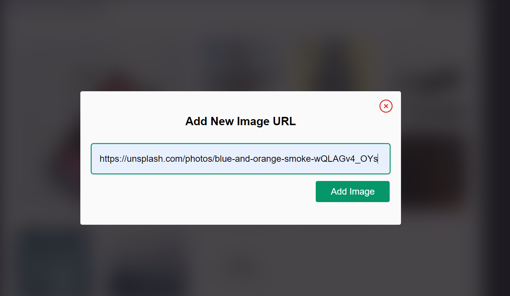

# Image Gallery Project

This project is a simple image gallery built using TypeScript, React.js,Tailwind and Vite. It allows users to drag and drop images to sort them, insert new images, and delete existing images.

## Technologies Used

- TypeScript
- React.js
- Vite
- Tailwind css

## Features

### Drag and Drop to Sort Images

Users can rearrange the order of images by dragging and dropping them within the gallery.

### Insert New Images

Users have the ability to insert new images into the gallery, expanding the collection.

### Delete Images

Unwanted images can be easily deleted from the gallery, providing a streamlined user experience.

<!-- add images -->

## Screen Shot

